# データフロー図

## 概要

このドキュメントは、プロジェクト内のデータがどのように流れ、各コンポーネント間でどのように共有されるかを可視化したものです。

## 1. プロジェクトデータの流れ

### 1.1 プロジェクト設定（project.json）の流れ

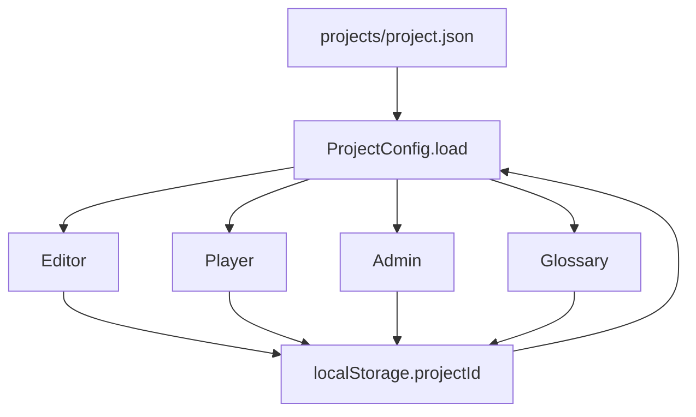

### 1.2 クイズデータ（quiz.json）の流れ

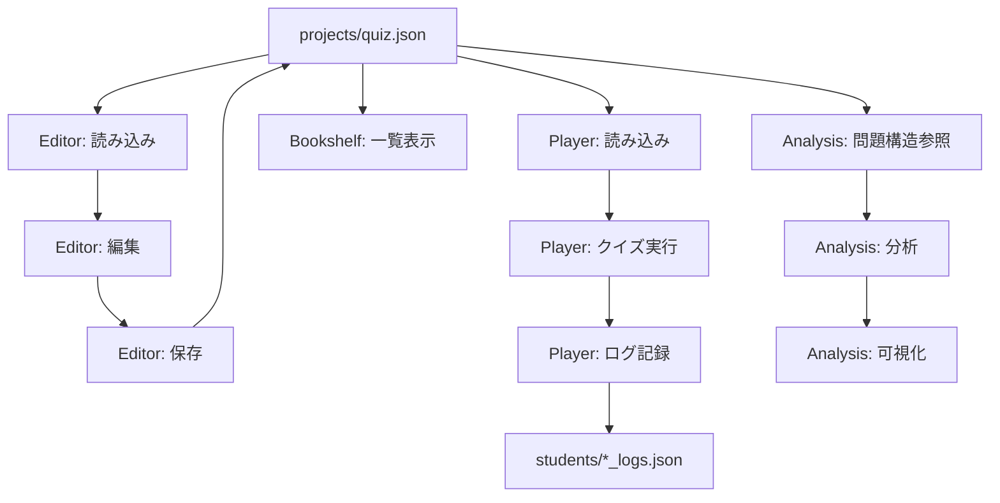

### 1.3 Glossaryデータの流れ

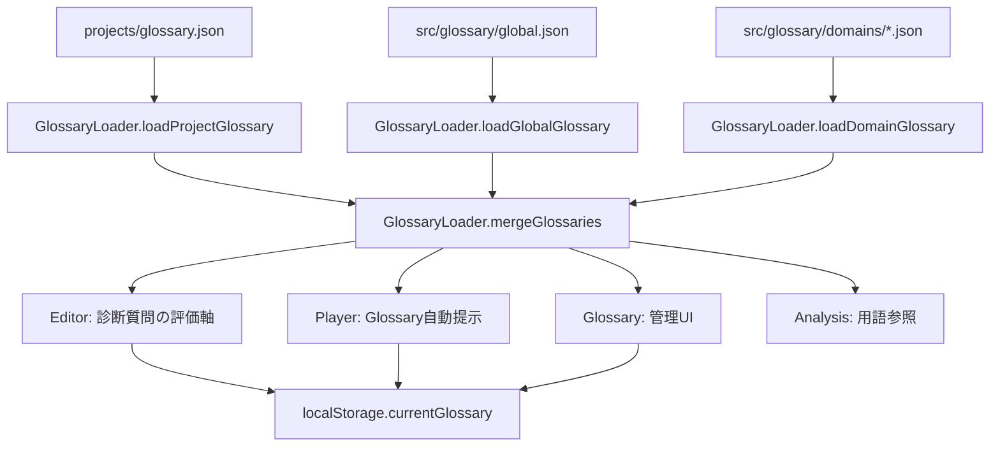

## 2. 学習データの流れ

### 2.1 学習ログの生成と保存

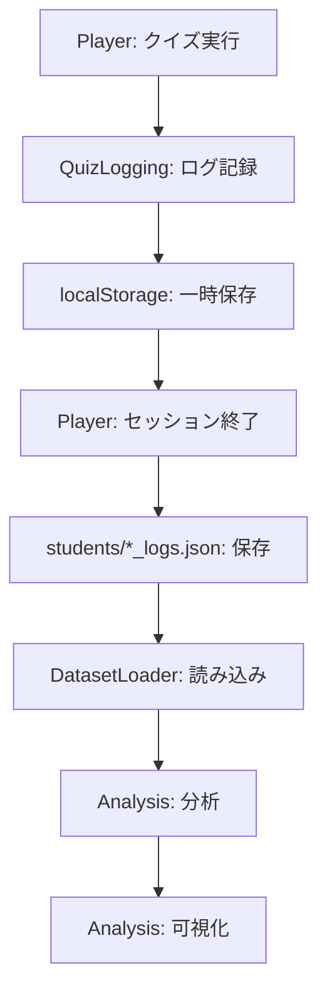

### 2.2 データセット一覧の流れ

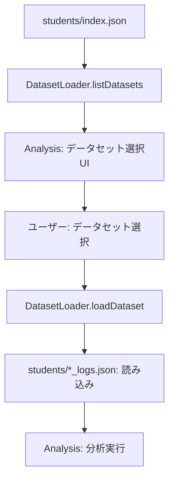

## 3. Editor / Player / Admin / Analysis の四大コンポーネント間の流れ

### 3.1 全体データフロー

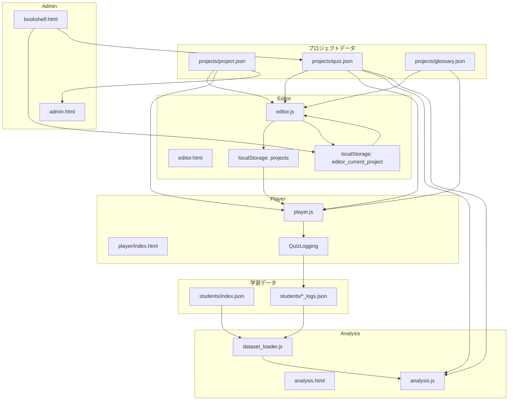

### 3.2 プロジェクト作成・編集フロー

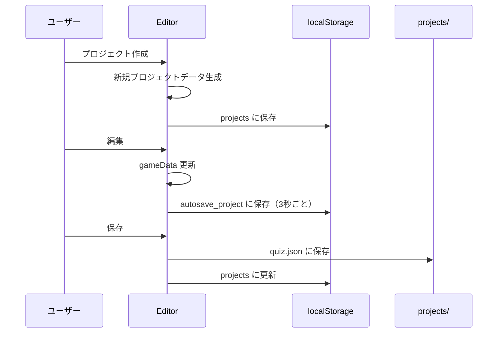

### 3.3 クイズ実行フロー

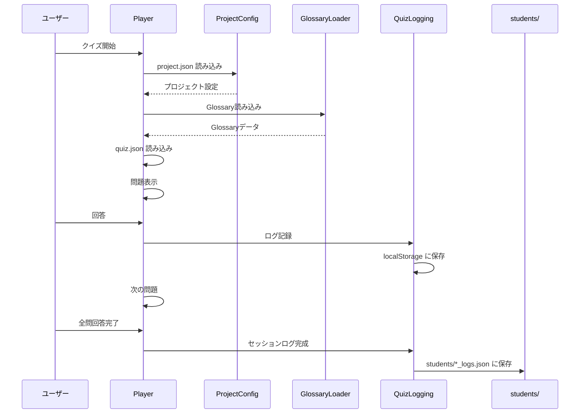

### 3.4 分析フロー

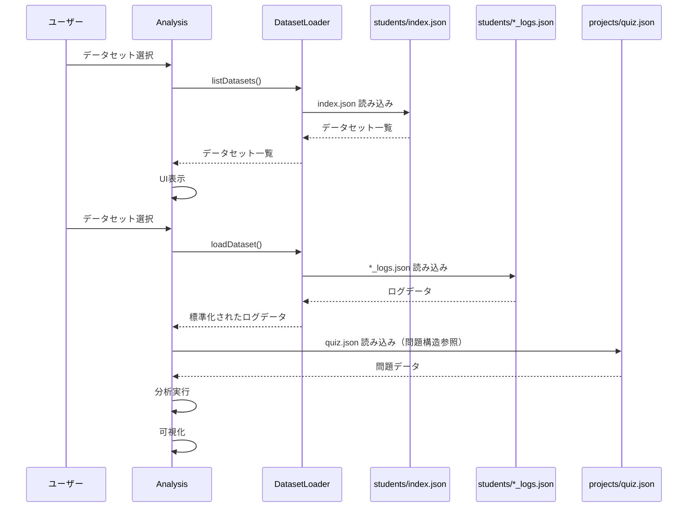

## 4. localStorage のデータフロー

### 4.1 Editor の localStorage フロー

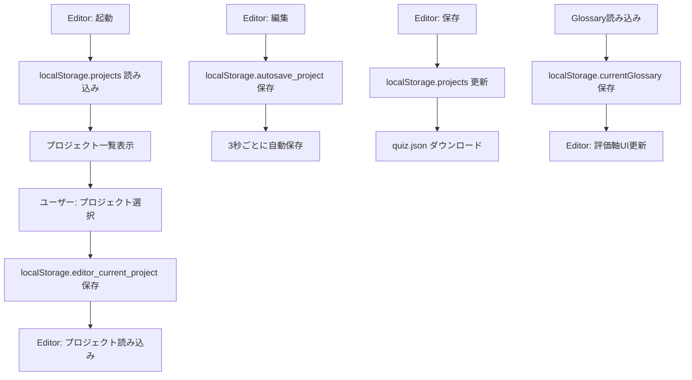

### 4.2 Player の localStorage フロー

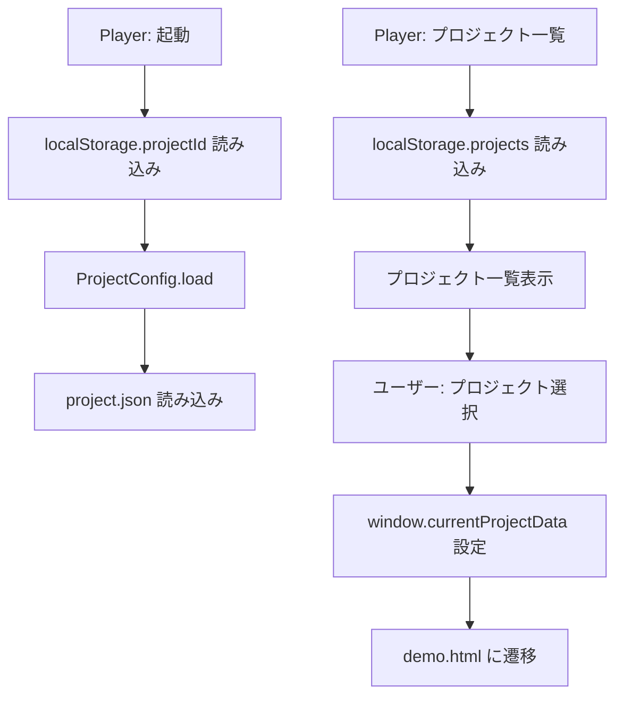

## 5. データ保存の関係

### 5.1 保存データの関係図

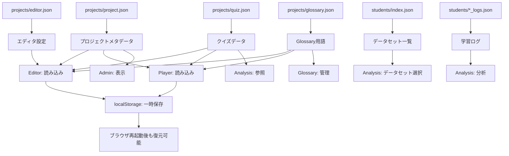

## 6. データ整合性の保証

### 6.1 データ整合性チェックポイント

1. **プロジェクトIDの一貫性**
   - `localStorage.projectId` ↔ `projects/{projectId}/project.json`
   - チェック: `ProjectConfig.load()` で整合性確認

2. **Glossaryの統合**
   - `projects/{projectId}/glossary.json` + `src/glossary/global.json` + `src/glossary/domains/*.json`
   - チェック: `GlossaryLoader.mergeGlossaries()` で重複排除

3. **クイズデータの整合性**
   - `quiz.json` の `startNode` ↔ `questions[].id`
   - チェック: `normalizeGameData()` で正規化

4. **学習ログの整合性**
   - `students/*_logs.json` の `session_id` の一意性
   - チェック: `DatasetLoader.loadDataset()` で標準化

### 6.2 データ不整合のリスク

1. **localStorage とファイルシステムの不整合**
   - リスク: `localStorage.projects` に存在するが、実際のファイルが削除されている
   - 対策: ファイル存在確認を追加

2. **Glossary用語IDの重複**
   - リスク: 複数のGlossaryで同じIDの用語が定義されている
   - 対策: `GlossaryLoader.mergeGlossaries()` で後勝ち（Project > Domain > Global）

3. **クイズバージョンの不整合**
   - リスク: `quiz.json` と `quiz_versions/latest.json` の不一致
   - 対策: バージョン管理システムで整合性保証

## 7. データフローの改善案

### 7.1 推奨される改善

1. **データバリデーション層の追加**
   - 各データ読み込み時にスキーマ検証を実施
   - JSON Schema を使用した検証

2. **キャッシュ戦略の最適化**
   - `localStorage` とファイルシステムの同期を改善
   - キャッシュ無効化の仕組みを追加

3. **エラーハンドリングの強化**
   - データ読み込み失敗時のフォールバック処理
   - ユーザーへのエラーメッセージ表示

4. **データバックアップ機能**
   - 自動バックアップの実装
   - 復元機能の追加

