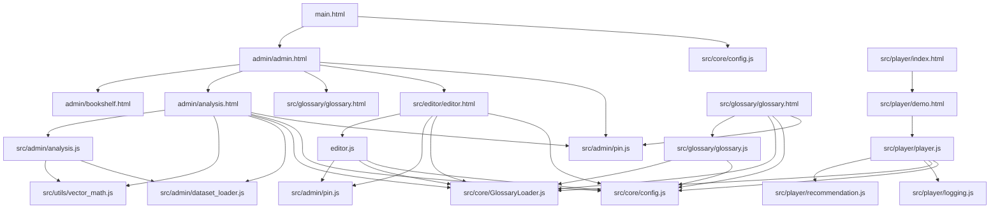
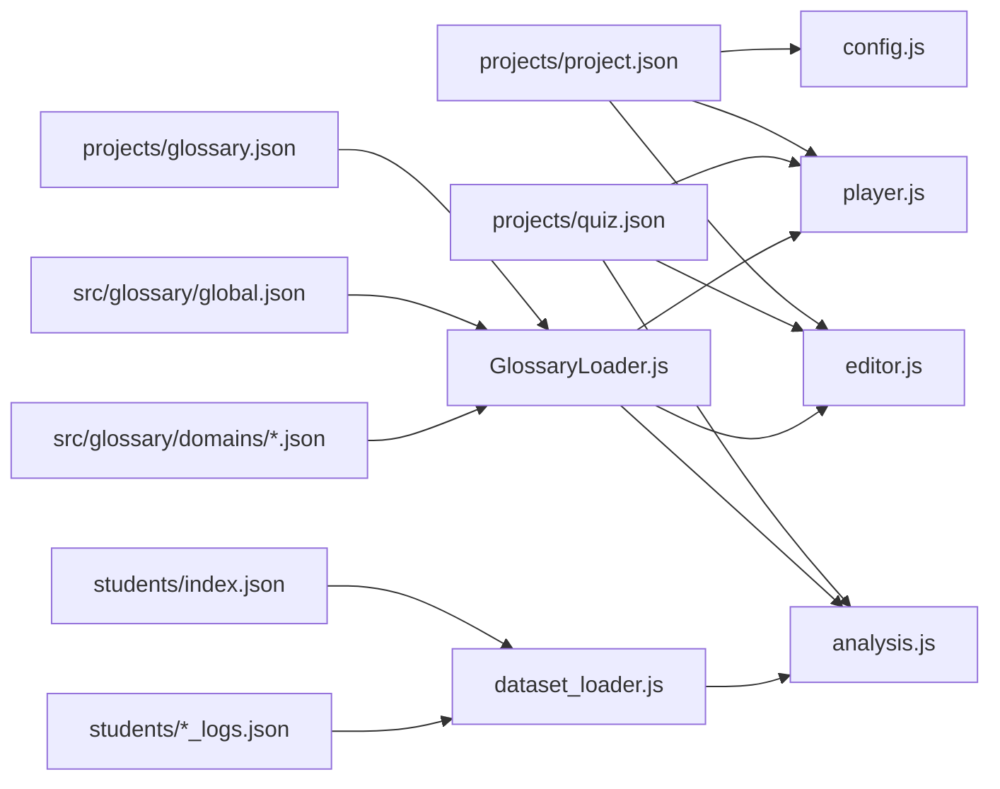
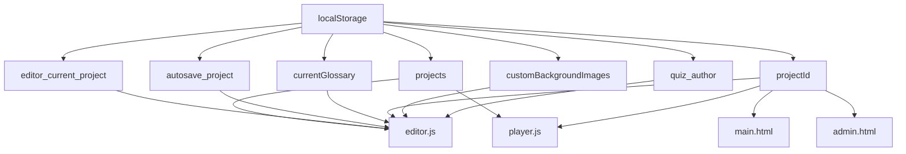

# コード依存関係マップ

## 概要

このドキュメントは、プロジェクト内のすべての JavaScript モジュール、HTML、JSON ファイル間の依存関係を可視化したものです。

## 1. JS モジュール依存関係

### 1.1 コアモジュール

#### `src/core/config.js`
- **役割**: プロジェクト設定（project.json）の読み込み・保存
- **依存**: なし（独立モジュール）
- **グローバル変数**: `ProjectConfig`
- **使用箇所**:
  - `src/editor/editor.html` → `editor.js`
  - `src/player/player.js`
  - `admin/admin.html`
  - `main.html`

#### `src/core/GlossaryLoader.js`
- **役割**: 3層構造のGlossary（Global/Domain/Project）を読み込み・統合
- **依存**: なし（独立モジュール）
- **グローバル変数**: `GlossaryLoader`
- **使用箇所**:
  - `src/editor/editor.html` → `editor.js`
  - `src/player/player.js`
  - `admin/analysis.html` → `analysis.js`
  - `src/glossary/glossary.html` → `glossary.js`

### 1.2 エディタモジュール

#### `editor.js` (ルート)
- **役割**: クイズエディタのメインロジック
- **依存**:
  - `src/core/config.js` (ProjectConfig)
  - `src/core/GlossaryLoader.js` (GlossaryLoader)
  - `src/admin/pin.js` (AdminAuth)
- **グローバル変数**:
  - `window.currentGlossary` - 現在のGlossaryデータ
  - `window.refreshVectorAxis` - ベクトル軸UI更新関数
  - `window.loadTemplate` - テンプレート読み込み関数
  - `window.saveProjectAs` - プロジェクト保存関数
  - `window.loadProjectData` - プロジェクト読み込み関数
  - `window.openProjectShelf` - プロジェクト本棚UI表示関数
- **読み込み元**: `src/editor/editor.html`

#### `src/editor/editor.js`
- **役割**: エディタのラッパー（ルートの`editor.js`を読み込む）
- **依存**: `../../editor.js`

### 1.3 プレイヤーモジュール

#### `src/player/player.js`
- **役割**: クイズプレイヤーのメインロジック
- **依存**:
  - `src/core/config.js` (ProjectConfig)
  - `src/core/GlossaryLoader.js` (GlossaryLoader)
  - `src/player/recommendation.js` (GlossaryRecommendation)
  - `src/player/logging.js` (QuizLogging)
- **グローバル変数**: `global.QuizPlayer`
- **読み込み元**: `src/player/demo.html`

#### `src/player/logging.js`
- **役割**: クイズログの記録・管理
- **依存**: なし（独立モジュール）
- **グローバル変数**: `QuizLogging`

#### `src/player/recommendation.js`
- **役割**: Glossary用語の自動推薦
- **依存**: なし（独立モジュール）
- **グローバル変数**: `GlossaryRecommendation`

### 1.4 管理モジュール

#### `src/admin/dataset_loader.js`
- **役割**: 学習データセット（students/*.json）の読み込み
- **依存**: なし（独立モジュール）
- **グローバル変数**: `DatasetLoader`
- **使用箇所**: `admin/analysis.html` → `analysis.js`

#### `src/admin/analysis.js`
- **役割**: 学習データ分析ダッシュボード
- **依存**:
  - `src/admin/dataset_loader.js` (DatasetLoader)
  - `src/utils/vector_math.js` (ベクトル計算)
  - Chart.js (外部CDN)
- **グローバル変数**: `AnalysisDashboard`
- **読み込み元**: `admin/analysis.html`

#### `src/admin/pin.js`
- **役割**: PIN認証・管理者認証
- **依存**: なし（独立モジュール）
- **グローバル変数**: `AdminAuth`
- **使用箇所**:
  - `admin/admin.html`
  - `admin/analysis.html`
  - `src/editor/editor.html`
  - `src/glossary/glossary.html`

#### `src/admin/version_manager.js`
- **役割**: クイズバージョン管理
- **依存**: `src/core/config.js`
- **グローバル変数**: `VersionManager`

#### `src/glossary/glossary.js`
- **役割**: Glossary管理UI
- **依存**:
  - `src/core/config.js` (ProjectConfig)
  - `src/core/GlossaryLoader.js` (GlossaryLoader)
  - `src/admin/pin.js` (AdminAuth)
- **読み込み元**: `src/glossary/glossary.html`

#### `src/utils/vector_math.js`
- **役割**: ベクトル計算ユーティリティ
- **依存**: なし（独立モジュール）
- **使用箇所**: `src/admin/analysis.js`

### 1.5 依存関係グラフ

## 2. データ依存関係

### 2.1 プロジェクトデータ

#### `projects/{projectId}/project.json`
- **構造**: プロジェクトメタデータ（access_mode, pin_code, glossary_policy等）
- **読み込み元**:
  - `src/core/config.js` → `ProjectConfig.load()`
  - `main.html`
- **使用箇所**:
  - `src/player/player.js` - プロジェクト設定・Glossary読み込み
  - `src/editor/editor.js` - プロジェクト設定
  - `admin/admin.html` - プロジェクトID表示

#### `projects/{projectId}/quiz.json`
- **構造**: クイズデータ（questions, results, startNode等）
- **読み込み元**:
  - `editor.js` - エディタでの読み込み
  - `src/player/player.js` - プレイヤーでの読み込み
  - `admin/bookshelf.html` - プロジェクト一覧表示
- **使用箇所**:
  - `editor.js` - 編集・保存
  - `src/player/player.js` - クイズ実行
  - `src/admin/analysis.js` - 分析時の問題構造参照

#### `projects/{projectId}/editor.json`
- **構造**: エディタ固有の設定（lastEdited, layout等）
- **読み込み元**: `editor.js`
- **使用箇所**: `editor.js` - エディタ状態の復元

#### `projects/{projectId}/glossary.json`
- **構造**: プロジェクト固有のGlossary用語
- **読み込み元**: `src/core/GlossaryLoader.js` → `loadProjectGlossary()`
- **使用箇所**:
  - `editor.js` - 診断質問の評価軸設定
  - `src/player/player.js` - Glossary自動提示
  - `src/glossary/glossary.js` - Glossary管理UI

### 2.2 Glossaryデータ

#### `src/glossary/global.json`
- **構造**: グローバルGlossary用語
- **読み込み元**: `src/core/GlossaryLoader.js` → `loadGlobalGlossary()`
- **使用箇所**: すべてのコンポーネント（Editor/Player/Analysis）

#### `src/glossary/domains/{domainName}.json`
- **構造**: ドメイン固有のGlossary用語
- **読み込み元**: `src/core/GlossaryLoader.js` → `loadDomainGlossary()`
- **使用箇所**: プロジェクトの`glossary_policy.domains`で指定されたドメイン

### 2.3 学習データ

#### `students/index.json`
- **構造**: データセット一覧（datasets配列）
- **読み込み元**: `src/admin/dataset_loader.js` → `listDatasets()`
- **使用箇所**: `admin/analysis.html` - データセット選択UI

#### `students/{dataset_name}_logs.json`
- **構造**: 学習ログデータ（sessions配列、各セッションにlogs配列）
- **読み込み元**: `src/admin/dataset_loader.js` → `loadDataset()`
- **使用箇所**: `src/admin/analysis.js` - 学習データ分析

### 2.4 データ依存関係図

## 3. localStorage 依存関係

### 3.1 Editor の localStorage

| キー | 用途 | 読み込み元 | 書き込み元 |
|------|------|-----------|-----------|
| `projects` | 保存済みプロジェクト一覧 | `editor.js`, `player.js` | `editor.js` |
| `editor_current_project` | エディタで編集中のプロジェクト | `editor.js` | `editor.js`, `admin/bookshelf.html` |
| `autosave_project` | オートセーブデータ | `editor.js` | `editor.js` |
| `currentGlossary` | 現在のGlossaryデータ | `editor.js` | `editor.js` |
| `customBackgroundImages` | カスタム背景画像 | `editor.js` | `editor.js` |
| `projectId` | 現在のプロジェクトID | 全コンポーネント | `main.html`, `editor.js` |
| `quiz_author` | クイズ作成者 | `editor.js` | `editor.js` |

### 3.2 Player の localStorage

| キー | 用途 | 読み込み元 | 書き込み元 |
|------|------|-----------|-----------|
| `projects` | 保存済みプロジェクト一覧 | `player.js` | `player.js` |
| `projectId` | 現在のプロジェクトID | `player.js` | `player.js` |

### 3.3 localStorage 依存関係図

## 4. UI とデータの接続

### 4.1 Editor UI

**HTML**: `src/editor/editor.html`
- **JS**: `editor.js`
- **データソース**:
  - `projects/{projectId}/project.json` → `ProjectConfig.load()`
  - `projects/{projectId}/quiz.json` → `fetch()`
  - `projects/{projectId}/glossary.json` → `GlossaryLoader.loadProjectGlossary()`
  - `localStorage.projects` → プロジェクト一覧
  - `localStorage.editor_current_project` → 編集中データ
  - `localStorage.currentGlossary` → Glossaryデータ

### 4.2 Player UI

**HTML**: `src/player/index.html`, `src/player/demo.html`
- **JS**: `src/player/player.js`
- **データソース**:
  - `projects/{projectId}/project.json` → `ProjectConfig.load()`
  - `projects/{projectId}/quiz.json` → `QuizPlayer.loadQuiz()`
  - `projects/{projectId}/glossary.json` → `GlossaryLoader.loadGlossaryByPolicy()`
  - `localStorage.projects` → プロジェクト一覧

### 4.3 Admin UI

**HTML**: `admin/admin.html`
- **JS**: インラインスクリプト
- **データソース**:
  - `localStorage.projectId` → プロジェクトID表示
  - `projects/{projectId}/quiz_versions/latest.json` → バージョン一覧

### 4.4 Analysis UI

**HTML**: `admin/analysis.html`
- **JS**: `src/admin/analysis.js`, `src/admin/dataset_loader.js`
- **データソース**:
  - `students/index.json` → `DatasetLoader.listDatasets()`
  - `students/{dataset_name}_logs.json` → `DatasetLoader.loadDataset()`
  - `projects/{projectId}/quiz.json` → 問題構造参照

### 4.5 Glossary UI

**HTML**: `src/glossary/glossary.html`
- **JS**: `src/glossary/glossary.js`
- **データソース**:
  - `projects/{projectId}/project.json` → `ProjectConfig.load()`
  - `projects/{projectId}/glossary.json` → `GlossaryLoader.loadProjectGlossary()`
  - `src/glossary/global.json` → `GlossaryLoader.loadGlobalGlossary()`
  - `src/glossary/domains/*.json` → `GlossaryLoader.loadDomainGlossary()`

### 4.6 Bookshelf UI

**HTML**: `admin/bookshelf.html`
- **JS**: インラインスクリプト
- **データソース**:
  - `projects/{projectId}/project.json` → `fetch()`
  - `projects/{projectId}/quiz.json` → `fetch()`
  - `localStorage.editor_current_project` → エディタへの読み込み

## 5. グローバル変数の使用状況

### 5.1 Editor のグローバル変数

- `window.currentGlossary` - 現在のGlossaryデータ（Editor/Player/Analysisで共有）
- `window.refreshVectorAxis` - ベクトル軸UI更新関数
- `window.loadTemplate` - テンプレート読み込み関数
- `window.saveProjectAs` - プロジェクト保存関数
- `window.loadProjectData` - プロジェクト読み込み関数
- `window.openProjectShelf` - プロジェクト本棚UI表示関数

### 5.2 Player のグローバル変数

- `global.QuizPlayer` - クイズプレイヤーAPI
- `window.currentProjectData` - 現在のプロジェクトデータ（index.html → demo.html）

### 5.3 Analysis のグローバル変数

- `AnalysisDashboard` - 分析ダッシュボードAPI
- `DatasetLoader` - データセット読み込みAPI

### 5.4 Core のグローバル変数

- `ProjectConfig` - プロジェクト設定API
- `GlossaryLoader` - Glossary読み込みAPI

## 6. 循環依存のリスク

### 6.1 潜在的な循環依存

1. **Editor ↔ Glossary**
   - `editor.js` → `GlossaryLoader.js` → `projects/{projectId}/glossary.json`
   - `glossary.js` → `GlossaryLoader.js` → `projects/{projectId}/glossary.json`
   - **リスク**: 低（GlossaryLoaderは独立モジュール）

2. **Editor ↔ Player**
   - `editor.js` → `localStorage.projects`
   - `player.js` → `localStorage.projects`
   - **リスク**: 低（localStorageは共有ストレージ）

3. **Analysis ↔ Dataset**
   - `analysis.js` → `dataset_loader.js` → `students/index.json`
   - `dataset_loader.js` → `students/{dataset_name}_logs.json`
   - **リスク**: なし（一方向の依存）

### 6.2 推奨される改善

1. **モジュール化**: グローバル変数の使用を減らし、ES6モジュールに移行
2. **依存注入**: グローバル変数への直接アクセスを避け、依存関係を明示
3. **イベント駆動**: コンポーネント間の通信をイベントベースに変更

