# UI遷移図

## 概要

このドキュメントは、プロジェクト内のすべてのHTMLページ間の遷移関係を可視化したものです。

## 1. メインナビゲーション

### 1.1 エントリーポイント

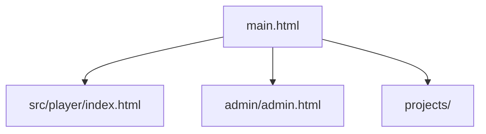

### 1.2 Admin ダッシュボードからの遷移

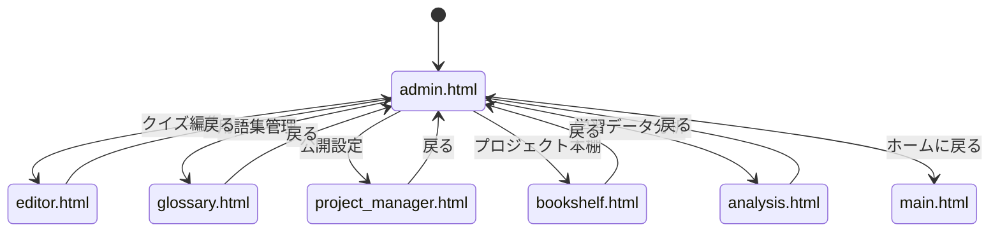

## 2. Editor の遷移

### 2.1 Editor の遷移フロー

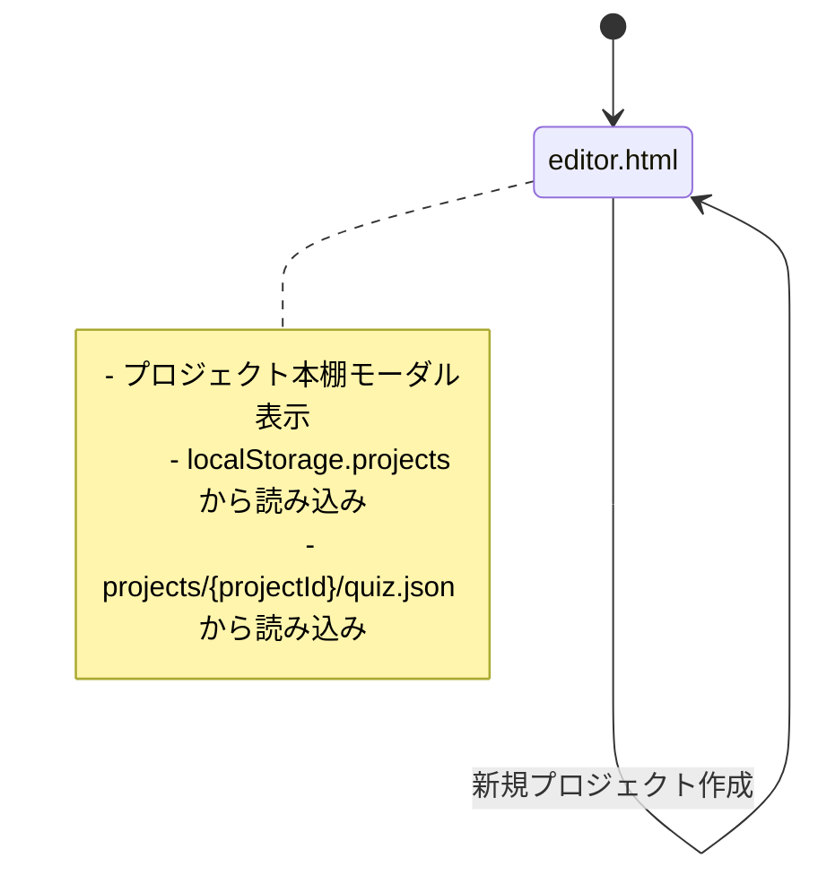

### 2.2 Editor の内部遷移

```mermaid
graph TD
    A[editor.html: 起動] --> B{URLパラメータ確認}
    B -->|projectId あり| C[loadProjectFromId]
    B -->|mode=edit あり| D[loadProjectFromLocalStorage]
    B -->|なし| E[新規プロジェクト]
    
    C --> F[projects/{projectId}/project.json]
    C --> G[projects/{projectId}/quiz.json]
    C --> H[projects/{projectId}/editor.json]
    
    D --> I[localStorage.editor_current_project]
    
    F --> J[エディタUI表示]
    G --> J
    H --> J
    I --> J
    E --> J
    
    J --> K[ユーザー: 編集]
    K --> L[オートセーブ: 3秒ごと]
    L --> M[localStorage.autosave_project]
    
    K --> N[ユーザー: 保存]
    N --> O[saveProjectAs]
    O --> P[quiz.json ダウンロード]
    O --> Q[localStorage.projects 更新]
```

## 3. Player の遷移

### 3.1 Player の遷移フロー

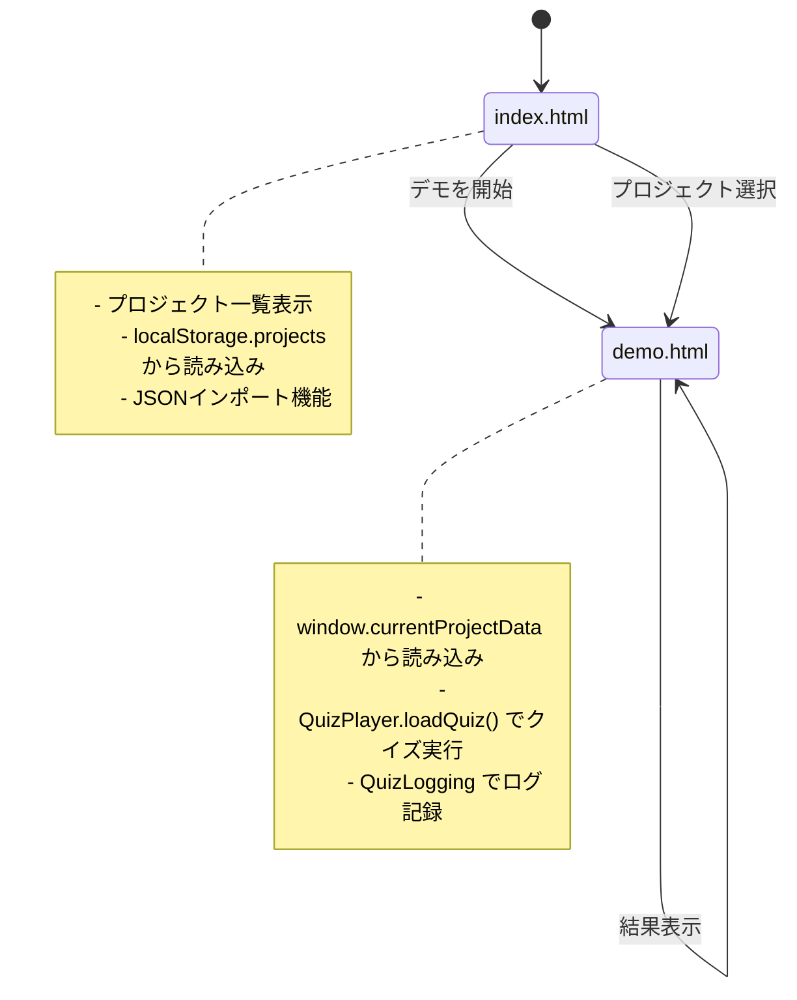

### 3.2 Player の内部遷移

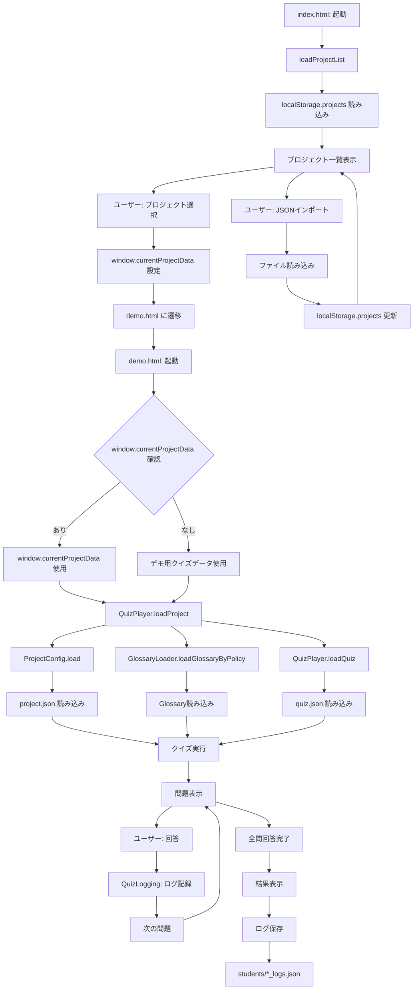

## 4. Analysis の遷移

### 4.1 Analysis の遷移フロー

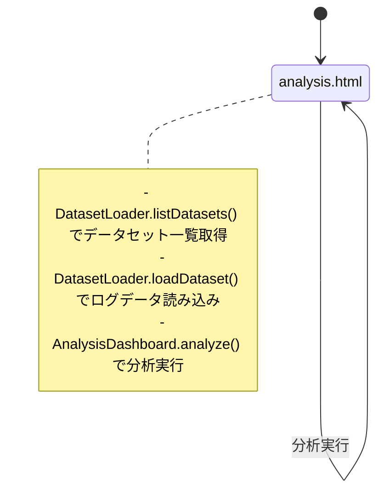

### 4.2 Analysis の内部遷移

```mermaid
graph TD
    A[analysis.html: 起動] --> B[DatasetLoader.listDatasets]
    B --> C[students/index.json 読み込み]
    C --> D[データセット一覧表示]
    
    D --> E[ユーザー: データセット選択]
    E --> F[DatasetLoader.loadDataset]
    F --> G[students/*_logs.json 読み込み]
    
    G --> H[ログデータ標準化]
    H --> I[セッション選択UI表示]
    
    I --> J[ユーザー: セッション選択]
    J --> K[AnalysisDashboard.analyze]
    
    I --> L[ユーザー: 全セッション合算]
    L --> M[AnalysisDashboard.mergeAllSessions]
    M --> K
    
    K --> N[projects/{projectId}/quiz.json 読み込み]
    N --> O[問題構造参照]
    
    K --> P[分析実行]
    O --> P
    
    P --> Q[全体統計]
    P --> R[問題別分析]
    P --> S[反応時間プロファイル]
    P --> T[パス分析]
    P --> U[Glossary提示履歴]
    P --> V[クラスタリング散布図]
    
    Q --> W[可視化]
    R --> W
    S --> W
    T --> W
    U --> W
    V --> W
```

## 5. Glossary の遷移

### 5.1 Glossary の遷移フロー

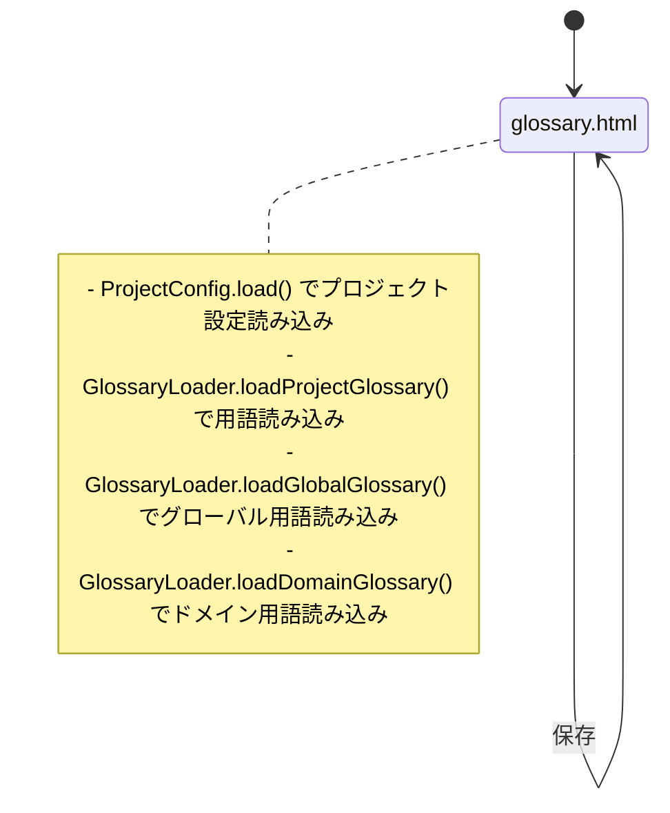

## 6. Bookshelf の遷移

### 6.1 Bookshelf の遷移フロー

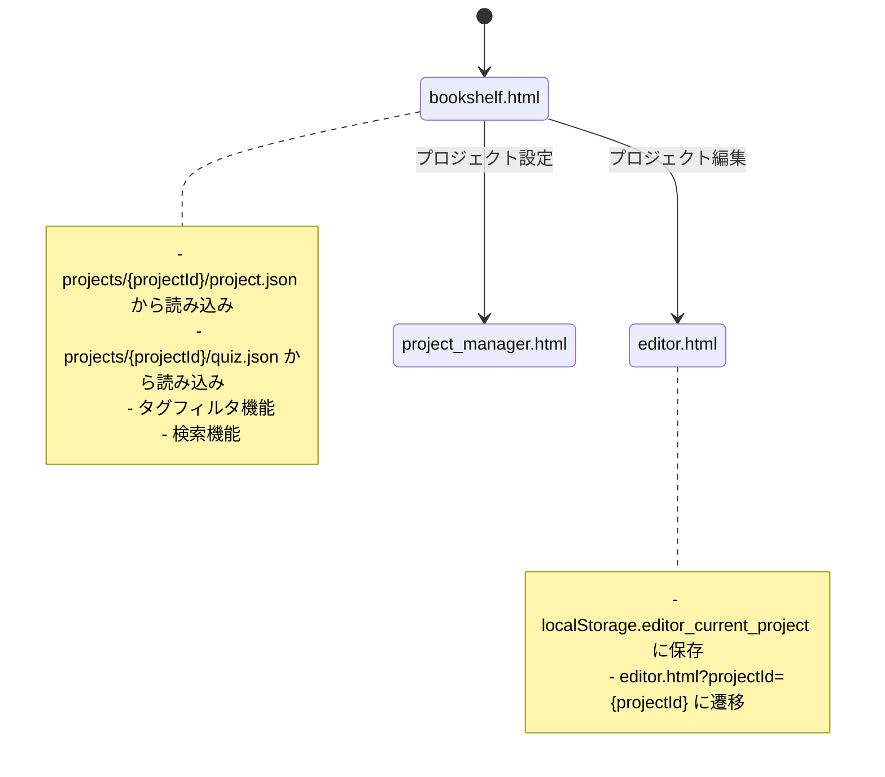

### 6.2 Bookshelf の内部遷移

```mermaid
graph TD
    A[bookshelf.html: 起動] --> B[loadProjects]
    B --> C[プロジェクトフォルダ一覧]
    C --> D[projects/{projectId}/project.json 読み込み]
    C --> E[projects/{projectId}/quiz.json 読み込み]
    
    D --> F[プロジェクトメタデータ取得]
    E --> G[質問数取得]
    
    F --> H[プロジェクトカード表示]
    G --> H
    
    H --> I[ユーザー: タグフィルタ]
    I --> J[フィルタリング]
    J --> H
    
    H --> K[ユーザー: 検索]
    K --> L[検索フィルタリング]
    L --> H
    
    H --> M[ユーザー: プロジェクト選択]
    M --> N[loadProjectIntoEditor]
    N --> O[localStorage.editor_current_project 保存]
    O --> P[editor.html?projectId={projectId} に遷移]
    
    H --> Q[ユーザー: 設定ボタン]
    Q --> R[project_manager.html?projectId={projectId} に遷移]
```

## 7. 全体UI遷移図

### 7.1 完全なUI遷移図

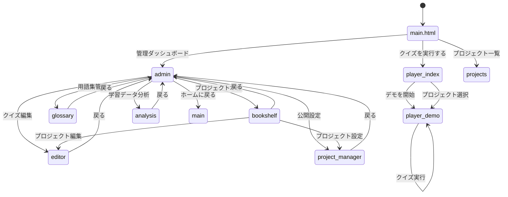

## 8. URLパラメータによる遷移

### 8.1 URLパラメータの使用

| ページ | パラメータ | 用途 |
|--------|-----------|------|
| `editor.html` | `projectId` | プロジェクトIDを指定して読み込み |
| `editor.html` | `mode=edit` | 編集モードで起動 |
| `project_manager.html` | `projectId` | プロジェクトIDを指定して設定表示 |
| `demo.html` | なし | `window.currentProjectData` から読み込み |

### 8.2 URLパラメータによる遷移フロー

```mermaid
graph TD
    A[bookshelf.html] -->|projectId={id}| B[editor.html?projectId={id}]
    B --> C[loadProjectFromId]
    C --> D[projects/{id}/project.json]
    C --> E[projects/{id}/quiz.json]
    C --> F[projects/{id}/editor.json]
    
    G[admin.html] -->|projectId={id}| H[project_manager.html?projectId={id}]
    H --> I[プロジェクト設定表示]
    
    J[index.html] -->|なし| K[demo.html]
    K --> L{window.currentProjectData 確認}
    L -->|あり| M[window.currentProjectData 使用]
    L -->|なし| N[デモ用クイズデータ使用]
```

## 9. 認証フロー

### 9.1 Admin認証フロー

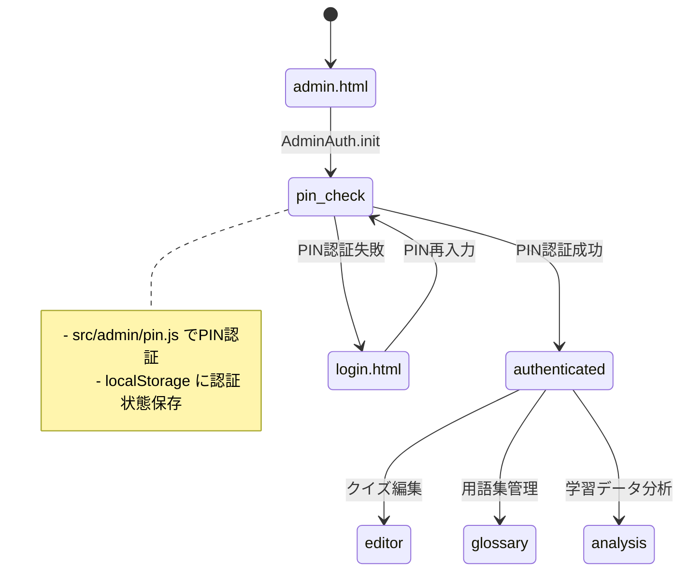

## 10. データ読み込みフロー

### 10.1 各ページのデータ読み込み順序

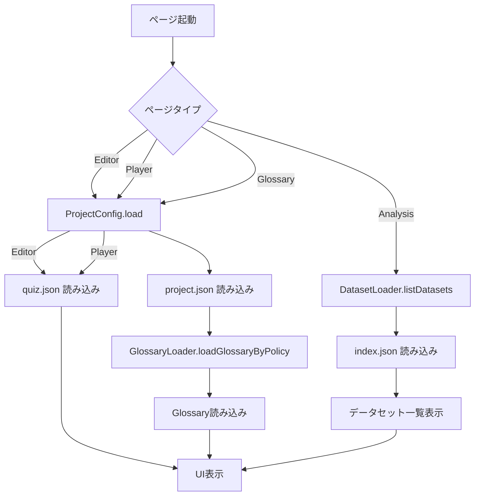

## 11. エラーハンドリングとフォールバック

### 11.1 エラー時の遷移

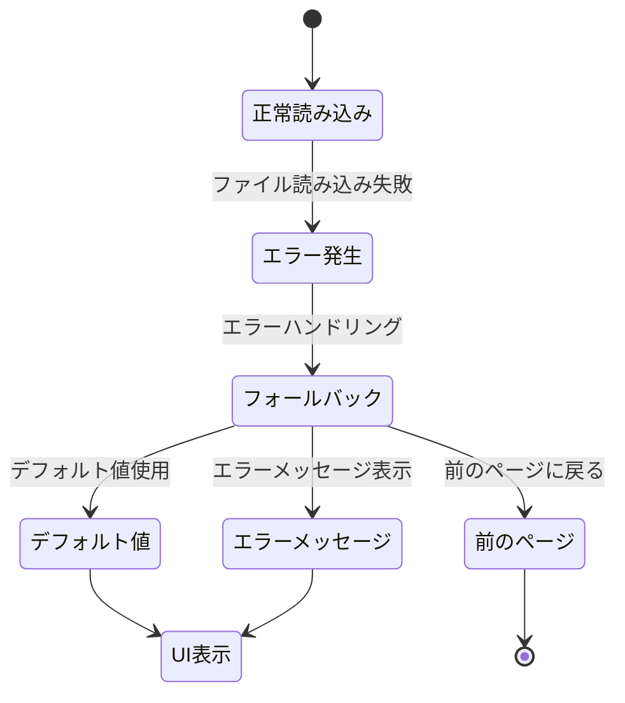

## 12. UI遷移の改善案

### 12.1 推奨される改善

1. **ルーティングシステムの導入**
   - 現在はHTMLファイル間の直接リンク
   - SPA（Single Page Application）化を検討
   - ルーティングライブラリ（例: Vue Router, React Router）の導入

2. **ナビゲーションコンポーネントの統一**
   - 各ページに共通のナビゲーションバーを追加
   - パンくずリストの実装

3. **遷移アニメーションの追加**
   - ページ遷移時のトランジション効果
   - ローディングインジケーター

4. **深いリンクのサポート**
   - URLパラメータによる状態復元の強化
   - ブラウザの戻る/進むボタンとの連携

